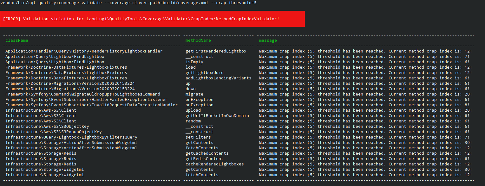

# Landingi Code Quality Tools

Repository with customized code quality checks tools. This is still POC so any changes appreciated!

The tool was created to support the maintenance of clean code by developers. The current functionality checks the quality of the code in terms of crap index.

## How to install?
```
composer require --dev landingi/crap-metric-analyzer
```

## How to contribute?

## Usage
### quality:coverage-validate

Currently, supports coverage report formats:
- Clover (`--coverage-clover-path PATH`)

Currently, supports validations:
- Crap (`--crap-threshold THRESHOLD`)
  - Crap index per method

There is possibility to run it through docker image e.g: `docker run --rm -v $(pwd):/project FILL_WITH_IMAGE:latest quality:coverage-validate --coverage-clover-path=resources/coverage/crap/crappy_test_object.xml --crap-threshold 5`

Example output:

